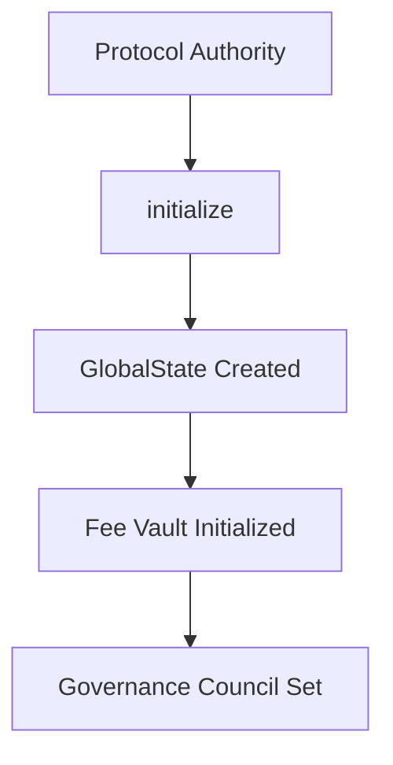
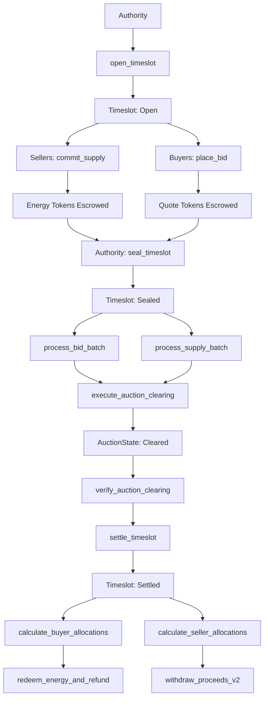
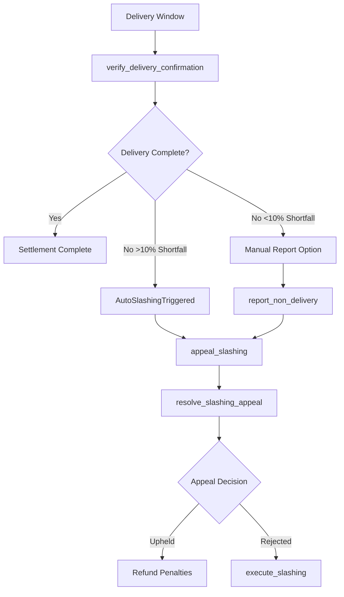

# Energy Auction Smart Contract - Complete Technical Documentation

## Table of Contents
1. [Getting Started](#getting-started)
2. [Overview](#overview)
3. [Architecture](#architecture)
4. [Core Components](#core-components)
5. [Program Flow](#program-flow)
6. [State Transitions](#state-transitions)
7. [Example Scenario](#example-scenario)
8. [Security Features](#security-features)
9. [Governance System](#governance-system)
10. [Emergency Controls](#emergency-controls)
11. [Technical Implementation](#technical-implementation)

---

## Getting Started

### Prerequisites Installation

This guide will help you set up the complete development environment for the Energy Auction smart contract.

#### 1. Install Rust (Required Version: 1.75+)
```bash
# Install Rust via rustup
curl --proto '=https' --tlsv1.2 -sSf https://sh.rustup.rs | sh
source ~/.cargo/env

# Verify installation
rustc --version
cargo --version
```

#### 2. Install Solana CLI (Required Version: 1.18+)
```bash
# Install Solana CLI
sh -c "$(curl -sSfL https://release.solana.com/v1.18.26/install)"

# Add to PATH (add to ~/.zshrc or ~/.bashrc)
export PATH="$HOME/.local/share/solana/install/active_release/bin:$PATH"

# Verify installation
solana --version
```

#### 3. Install Anchor Framework (Required Version: 0.31.1)
```bash
# Install Anchor via cargo
cargo install --git https://github.com/coral-xyz/anchor avm --locked --force

# Install Anchor version 0.31.1
avm install 0.31.1
avm use 0.31.1

# Verify installation
anchor --version
```

#### 4. Install Node.js and Yarn
```bash
# Install Node.js (v18+ recommended)
# Using nvm (recommended):
curl -o- https://raw.githubusercontent.com/nvm-sh/nvm/v0.39.0/install.sh | bash
nvm install 18
nvm use 18

# Install Yarn
npm install -g yarn

# Verify installations
node --version
yarn --version
```

### Project Setup

#### 1. Clone the Repository
```bash
git clone https://github.com/anujs101/energy_auction.git
cd energy_auction
```

#### 2. Install Dependencies
```bash
# Install Rust dependencies (automatically handled by Cargo)
cargo check

# Install Node.js dependencies
yarn install
```

#### 3. Configure Solana Environment
```bash
# Set Solana to localnet for development
solana config set --url localhost

# Create a new keypair (if you don't have one)
solana-keygen new --outfile ~/.config/solana/id.json

# Verify configuration
solana config get
```

### Building the Project

#### 1. Build the Smart Contract
```bash
# Build the Anchor program
anchor build

# This should output:
# ✓ Built target/deploy/energy_auction.so
# ✓ Built target/idl/energy_auction.json
```

#### 2. Generate Program Keypair (if needed)
```bash
# Generate new program keypair
anchor keys list

# If you need to sync the program ID:
anchor keys sync
```

### Running Tests

#### 1. Start Local Solana Validator
```bash
# Start local validator (in a separate terminal)
solana-test-validator

# Keep this running in the background
# You should see: "Ledger location: test-ledger"
```

#### 2. Deploy to Local Network
```bash
# Deploy the program to localnet
anchor deploy

# Verify deployment
solana program show 5jcCqhVXRebbuCMVeRtm18FQiNiWUrQBdxkevyCWLCE7
```

#### 3. Run Test Suite
```bash
# Run all tests
anchor test

# Or run specific test files:
yarn test tests/basic-flow.test.ts
yarn test tests/edge-cases.test.ts
yarn test tests/emergency-controls.test.ts
yarn test tests/security.test.ts

# Run tests with verbose output
anchor test -- --reporter spec
```


### Common Setup Issues & Solutions

#### Issue 1: Anchor Version Mismatch
```bash
# Error: "anchor-lang version mismatch"
# Solution: Ensure Anchor 0.31.1 is installed
avm use 0.31.1
anchor --version
```

#### Issue 2: Solana CLI Not Found
```bash
# Error: "solana: command not found"
# Solution: Add Solana to PATH
echo 'export PATH="$HOME/.local/share/solana/install/active_release/bin:$PATH"' >> ~/.zshrc
source ~/.zshrc
```

#### Issue 3: Program Deploy Fails
```bash
# Error: "insufficient funds"
# Solution: Airdrop SOL to your wallet
solana airdrop 10

# Verify balance
solana balance
```

#### Issue 4: Test Validator Issues
```bash
# Error: "unable to connect to validator"
# Solution: Reset test validator
pkill solana-test-validator
rm -rf test-ledger
solana-test-validator --reset
```

### Development Workflow

#### 1. Making Changes
```bash
# 1. Edit contract code in programs/energy_auction/src/lib.rs
# 2. Rebuild the program
anchor build

# 3. Redeploy (if needed)
anchor deploy

# 4. Run tests to verify changes
anchor test
```

#### 2. Adding New Tests
```bash
# Create new test file in tests/ directory
# Follow existing test patterns in:
# - tests/basic-flow.test.ts
# - tests/edge-cases.test.ts
# - tests/emergency-controls.test.ts
```

#### 3. Debugging Tests
```bash
# Run single test with console output
yarn run ts-mocha -p ./tsconfig.json tests/basic-flow.test.ts --grep "specific test name"

# Enable debug logging
ANCHOR_LOG=debug anchor test
```

### Project Structure Overview
```
energy_auction/
├── programs/energy_auction/src/lib.rs  # Main smart contract
├── tests/                              # TypeScript test suite
├── Anchor.toml                         # Anchor configuration
├── Cargo.toml                          # Rust workspace config
├── package.json                        # Node.js dependencies
└── tsconfig.json                       # TypeScript configuration
```

### Next Steps
After successful setup:
1. **Explore the contract**: Read through `programs/energy_auction/src/lib.rs`
2. **Run example tests**: Start with `tests/basic-flow.test.ts`
3. **Study the documentation**: Continue reading this document for detailed analysis
4. **Experiment**: Try modifying parameters and running tests

---

## Overview

The Energy Auction Smart Contract is a sophisticated **decentralized energy trading platform** built on Solana, implementing a **double auction mechanism** with merit order processing. It enables multiple energy sellers and buyers to participate in time-based auctions with automated clearing, settlement, and delivery verification.

### Key Features
- **Multi-seller, multi-buyer marketplace** with merit order processing
- **Batch auction clearing** with supply/demand curve intersection
- **Automated slashing system** for delivery failures
- **Multi-signature governance** with parameter control
- **Emergency pause/resume** functionality
- **Oracle-based delivery verification**
- **Comprehensive refund mechanisms**

### Program ID
```
5jcCqhVXRebbuCMVeRtm18FQiNiWUrQBdxkevyCWLCE7
```

---

## Architecture

### Core Design Principles
1. **Merit Order Processing**: Sellers processed by ascending reserve price to prevent manipulation
2. **Atomic Operations**: All state changes use checked arithmetic with rollback mechanisms
3. **Batch Processing**: Scalable processing of large numbers of bids and supply commitments
4. **Multi-signature Security**: Critical operations require governance approval
5. **Oracle Integration**: External delivery verification for automated penalties

### Token Economics
- **Energy Tokens**: Represent actual energy units (e.g., kWh)
- **Quote Tokens**: Payment currency (e.g., USDC)
- **Escrow System**: Tokens locked until settlement or refund
- **Fee Structure**: Protocol fees deducted from seller proceeds
- **Slashing Penalties**: 150% penalty for delivery failures >10%

---

## Core Components

### 1. Account Types

#### Primary State Accounts
```rust
// Global protocol configuration
GlobalState {
    authority: Pubkey,           // Protocol admin
    fee_bps: u16,               // Protocol fee (basis points)
    max_sellers_per_timeslot: u16, // Up to 10,000 sellers
    slashing_penalty_bps: u16,   // Default 150% penalty
    governance_council: Vec<Pubkey>, // Multi-sig members
    authorized_oracles: Vec<Pubkey>, // Delivery verification
}

// Auction round container
Timeslot {
    epoch_ts: i64,              // Auction window identifier
    status: TimeslotStatus,     // Pending→Open→Sealed→Settled→Cancelled
    lot_size: u64,              // Fixed energy unit size
    clearing_price: u64,        // Final auction price
    total_sold_quantity: u64,   // Final quantity sold
}

// Seller energy commitment
Supply {
    supplier: Pubkey,           // Seller identity
    timeslot: Pubkey,          // Auction round
    amount: u64,               // Energy quantity committed
    reserve_price: u64,        // Minimum acceptable price
    escrow_vault: Pubkey,      // Escrowed energy tokens
}

// Paginated bid storage
BidPage {
    timeslot: Pubkey,          // Auction round
    bids: Vec<Bid>,            // Up to 150 bids per page
    next_page: Option<Pubkey>, // Linked list structure
}
```

#### Allocation & Settlement Accounts
```rust
// Individual seller allocation after clearing
SellerAllocation {
    supplier: Pubkey,
    allocated_quantity: u64,    // Energy to sell
    allocation_price: u64,      // Price received
    proceeds_withdrawn: bool,   // Settlement status
}

// Multi-seller energy distribution to buyers
BuyerAllocation {
    buyer: Pubkey,
    total_quantity_won: u64,    // Total energy purchased
    energy_sources: Vec<EnergySource>, // Which sellers provide energy
    refund_amount: u64,         // Over-bid refund
    total_cost: u64,           // Final payment
}

// Tracks auction clearing progress
AuctionState {
    clearing_price: u64,
    total_cleared_quantity: u64,
    status: AuctionStatus,      // Processing→Cleared→Settled→Failed
    winning_bids_count: u32,
    participating_sellers_count: u32,
}
```

#### Governance & Security Accounts
```rust
// Parameter change proposals
GovernanceProposal {
    proposer: Pubkey,
    proposal_type: ProposalType,
    new_value: u64,
    votes_for: u64,
    votes_against: u64,
    required_signatures: u8,    // Multi-sig requirement
    status: ProposalStatus,
}

// Delivery verification and penalties
SlashingState {
    supplier: Pubkey,
    allocated_quantity: u64,
    delivered_quantity: u64,
    slashing_amount: u64,
    status: SlashingStatus,     // Reported→UnderAppeal→Confirmed→Executed
    appeal_deadline: i64,
}

// Emergency protocol controls
EmergencyState {
    is_paused: bool,
    pause_timestamp: i64,
    pause_reason: [u8; 64],
    authority: Pubkey,
}
```

### 2. Core Instructions (34 total)

#### Auction Lifecycle
1. **initialize** - Initialize global protocol state
2. **open_timeslot** - Create new auction window
3. **commit_supply** - Seller commits energy with escrow
4. **place_bid** - Buyer places bid with quote token escrow
5. **seal_timeslot** - Freeze order flow for clearing
6. **process_bid_batch** - Process bids in batches for clearing
7. **process_supply_batch** - Process supply in merit order
8. **execute_auction_clearing** - Core auction clearing algorithm
9. **verify_auction_clearing** - Mathematical verification
10. **settle_timeslot** - Authority sets final results
11. **calculate_buyer_allocations** - Multi-seller energy distribution
12. **calculate_seller_allocations** - Merit order seller allocations
13. **withdraw_proceeds_v2** - Seller claims earnings
14. **redeem_energy_and_refund** - Buyer claims energy and refunds

#### Emergency & Cancellation
15. **cancel_auction** - Cancel auction in emergency
16. **refund_cancelled_auction_buyers** - Batch refund buyers
17. **refund_cancelled_auction_sellers** - Batch refund sellers
18. **emergency_pause** - Pause protocol operations
19. **emergency_resume** - Resume after pause
20. **emergency_withdraw** - Emergency fund recovery
21. **rollback_failed_auction** - Rollback failed auctions

#### Delivery Verification & Slashing
22. **verify_delivery_confirmation** - Oracle-based delivery verification
23. **report_non_delivery** - Report seller delivery failure
24. **appeal_slashing** - Appeal slashing decision
25. **execute_slashing** - Execute slashing penalties
26. **resolve_slashing_appeal** - Resolve appeals with evidence

#### Governance
27. **propose_parameter_change** - Create governance proposals
28. **vote_on_proposal** - Multi-signature voting
29. **execute_proposal** - Execute approved proposals
30. **validate_system_health** - System health monitoring

#### Registry Management
31. **register_seller** - Register seller in timeslot
32. **init_bid_registry** - Initialize bid page registry
33. **register_bid_page** - Register bid pages
34. **init_allocation_tracker** - Initialize allocation tracking

---

## Program Flow

### Phase 1: Initialization & Setup


### Phase 2: Auction Lifecycle


### Phase 3: Post-Settlement


---

## State Transitions

### Timeslot Status Flow
```
Pending → Open → Sealed → Settled
    ↓       ↓       ↓
Cancelled ← Cancelled ← Cancelled
```

### Auction Status Flow
```
Processing → Cleared → Settled
     ↓          ↓
   Failed ← Failed
```

### Slashing Status Flow
```
Reported → UnderAppeal → Confirmed → Executed
    ↓           ↓           ↓
AutoTriggered → Appealed → Reversed
```

### Bid Status Flow
```
Active → Filled
   ↓
Cancelled
```

---

## Example Scenario

Let's walk through a complete auction cycle with **3 sellers** and **2 buyers**:

### Initial Setup
```
Energy Token: kWh tokens
Quote Token: USDC
Lot Size: 1 kWh
Price Tick: $0.01
Protocol Fee: 2.5% (250 basis points)
```

### Step 1: Timeslot Opening
**Authority** opens auction for epoch `1699920000` (Nov 14, 2023 00:00 UTC):
```rust
open_timeslot(
    epoch_ts: 1699920000,
    lot_size: 1,
    price_tick: 100, // $0.01 in micro-units
)
```

**Result**: Timeslot created with status `Open`

### Step 2: Supply Commitments (Merit Order)
**Seller A** (Solar Farm):
```rust
commit_supply(
    timeslot_epoch: 1699920000,
    reserve_price: 8000, // $0.08/kWh
    quantity: 1000,      // 1000 kWh
)
```

**Seller B** (Wind Farm):
```rust
commit_supply(
    timeslot_epoch: 1699920000,
    reserve_price: 6000, // $0.06/kWh
    quantity: 800,       // 800 kWh
)
```

**Seller C** (Hydro Plant):
```rust
commit_supply(
    timeslot_epoch: 1699920000,
    reserve_price: 10000, // $0.10/kWh
    quantity: 500,        // 500 kWh
)
```

**Result**: 
- Total supply: 2300 kWh
- Energy tokens escrowed in seller vaults
- Merit order: Wind ($0.06) → Solar ($0.08) → Hydro ($0.10)

### Step 3: Bid Placement
**Buyer 1** (Data Center):
```rust
place_bid(
    page_index: 0,
    price: 9000,    // $0.09/kWh
    quantity: 600,  // 600 kWh
    timestamp: current_time,
)
```

**Buyer 2** (Manufacturing Plant):
```rust
place_bid(
    page_index: 0,
    price: 7000,    // $0.07/kWh
    quantity: 1200, // 1200 kWh
    timestamp: current_time,
)
```

**Result**:
- Total demand: 1800 kWh
- Quote tokens escrowed: (600 × $0.09) + (1200 × $0.07) = $138
- Demand curve: $0.09 (600 kWh) → $0.07 (1800 kWh cumulative)

### Step 4: Auction Sealing & Clearing
**Authority** seals the timeslot:
```rust
seal_timeslot() // Status: Open → Sealed
```

**Batch Processing**:
```rust
process_bid_batch(start_page: 0, end_page: 0)
// Processes all bids, creates demand curve

process_supply_batch(supplier_keys: [SellerA, SellerB, SellerC])
// Processes supply in merit order
```

**Auction Clearing Algorithm**:
```rust
execute_auction_clearing()
```

**Clearing Logic**:
1. **Supply Curve** (merit order):
   - Wind: 800 kWh @ $0.06
   - Solar: 1800 kWh @ $0.08 (cumulative)
   - Hydro: 2300 kWh @ $0.10 (cumulative)

2. **Demand Curve**:
   - 600 kWh @ $0.09
   - 1800 kWh @ $0.07 (cumulative)

3. **Intersection Analysis**:
   - At $0.07: Demand = 1800 kWh, Supply = 1800 kWh ✓
   - **Clearing Price**: $0.07/kWh
   - **Cleared Quantity**: 1800 kWh

### Step 5: Allocation Calculation

**Seller Allocations** (merit order):
```rust
calculate_seller_allocations()
```
- **Wind Farm**: 800 kWh @ $0.07 = $56
- **Solar Farm**: 1000 kWh @ $0.07 = $70
- **Hydro Plant**: 0 kWh (reserve price $0.10 > clearing price $0.07)

**Buyer Allocations**:
```rust
calculate_buyer_allocations()
```
- **Buyer 1**: 600 kWh @ $0.07 = $42 (refund: $54 - $42 = $12)
- **Buyer 2**: 1200 kWh @ $0.07 = $84 (no refund, exact match)

### Step 6: Settlement & Redemption

**Sellers Withdraw Proceeds**:
```rust
withdraw_proceeds_v2()
```
- **Wind Farm**: $56 - 2.5% fee = $54.60
- **Solar Farm**: $70 - 2.5% fee = $68.25
- **Protocol Fees**: $3.15 to fee vault

**Buyers Redeem Energy**:
```rust
redeem_energy_and_refund()
```
- **Buyer 1**: Receives 600 kWh + $12 refund
  - Energy sources: 600 kWh from Wind Farm
- **Buyer 2**: Receives 1200 kWh
  - Energy sources: 200 kWh from Wind + 1000 kWh from Solar

### Step 7: Delivery Verification

**Oracle Verification** (24 hours after settlement):
```rust
verify_delivery_confirmation(
    delivery_report: {
        supplier: WindFarm,
        delivered_quantity: 750, // 50 kWh shortfall
        evidence_hash: [oracle_proof],
    }
)
```

**Automatic Slashing Trigger**:
- Shortfall: 50 kWh (6.25% < 10% threshold)
- No automatic slashing triggered
- Manual reporting still available

**If shortfall >10%**:
- Automatic slashing: 150% penalty
- Appeal window: 3 days (auto-triggered) vs 7 days (manual)
- Penalty calculation: `shortfall × clearing_price × 1.5`

---

## State Transitions

### 1. Timeslot Lifecycle
```
┌─────────┐    open_timeslot()    ┌──────┐
│ Pending │ ──────────────────→ │ Open │
└─────────┘                      └──────┘
                                    │
                                    │ commit_supply()
                                    │ place_bid()
                                    ▼
                                 ┌────────┐
                                 │ Sealed │ ←── seal_timeslot()
                                 └────────┘
                                    │
                                    │ execute_auction_clearing()
                                    │ settle_timeslot()
                                    ▼
                                ┌─────────┐
                                │ Settled │
                                └─────────┘
                                    │
                                    │ All proceeds withdrawn
                                    ▼
                                ┌──────────┐
                                │ Complete │
                                └──────────┘

Emergency Path:
Any State ──── cancel_auction() ───→ ┌───────────┐
                                     │ Cancelled │
                                     └───────────┘
```

### 2. Auction Processing Flow
```
┌─────────────┐    process_bid_batch()     ┌─────────────┐
│ Timeslot    │ ─────────────────────────→ │ Auction     │
│ Sealed      │                            │ Processing  │
└─────────────┘                            └─────────────┘
                                                  │
                                                  │ execute_auction_clearing()
                                                  ▼
                                           ┌─────────────┐
                                           │ Auction     │
                                           │ Cleared     │
                                           └─────────────┘
                                                  │
                                                  │ verify_auction_clearing()
                                                  ▼
                                           ┌─────────────┐
                                           │ Auction     │
                                           │ Settled     │
                                           └─────────────┘
```

### 3. Merit Order Processing
```
Supply Commitments → Sort by Reserve Price → Process in Order

Example:
Seller A: 1000 kWh @ $0.08
Seller B: 800 kWh @ $0.06   ←── Processed First (lowest price)
Seller C: 500 kWh @ $0.10

Processing Order: B → A → C
Allocation: B gets 800 kWh, A gets remaining demand, C gets remainder/nothing
```

---

## Security Features

### 1. Authorization Patterns
- **Authority Checks**: All admin functions use `require_keys_eq!`
- **Signer Requirements**: Proper signer validation in user instructions
- **Account Ownership**: PDA derivation prevents account substitution
- **Multi-signature**: Council voting for critical operations

### 2. Numerical Safety
- **Overflow Protection**: All arithmetic uses `checked_*` operations
- **Type Conversions**: Safe u64/u128 conversions with error handling
- **Precision Handling**: Basis point calculations (10,000 denominator)
- **Bounds Checking**: Parameter validation with configurable limits

### 3. Economic Security
- **Merit Order Enforcement**: Prevents price manipulation
- **Escrow System**: Tokens locked until settlement
- **Slashing Penalties**: 150% penalty for delivery failures
- **Fee Validation**: Protocol fees capped at 10%

### 4. Account Validation
- **PDA Derivation**: Consistent seed patterns
- **Account Constraints**: Proper mint/owner constraints
- **Data Validation**: Account size and discriminator checks
- **State Consistency**: Cross-account state validation

---

## Governance System

### 1. Proposal Types
```rust
enum ProposalType {
    FeeBps,                    // Protocol fee changes
    MaxSellersPerTimeslot,     // Scalability parameters
    SlashingPenaltyBps,        // Penalty rates
    DeliveryWindowDuration,    // Timing parameters
    EmergencyParameterChange,  // Fast-track changes
    ProtocolUpgrade,           // Contract upgrades
}
```

### 2. Voting Mechanism
- **Council Members**: Enhanced voting power with multiplier
- **Stakeholder Voting**: Minimum stake requirement
- **Multi-signature**: Required signatures based on proposal type
- **Quorum Requirements**: Minimum participation threshold

### 3. Execution Timelock
- **Normal Proposals**: 24-hour timelock
- **Protocol Upgrades**: 48-hour timelock
- **Emergency Changes**: Immediate execution
- **Signature Requirements**: 2/3 for emergency, 3/4 for upgrades

---

## Emergency Controls

### 1. Circuit Breaker System
```rust
validate_system_health() → SystemHealthReport {
    overall_status: Healthy | Warning | Critical,
    active_auctions: u32,
    failed_deliveries: u32,
    emergency_pause_active: bool,
}
```

### 2. Emergency Pause Triggers
- **Manual**: Authority-triggered pause
- **Automatic**: Circuit breaker for critical issues
- **Conditions**: System health monitoring
- **Recovery**: 30-day wait for fund recovery

### 3. Emergency Withdrawal Types
```rust
enum EmergencyWithdrawalType {
    CancelledAuction,  // Immediate refund processing
    StuckFunds,        // 30-day wait period
    ProtocolUpgrade,   // Multi-signature required
}
```

---

## Technical Implementation

### 1. Batch Processing Architecture
```rust
// Bid processing in chunks
process_bid_batch(start_page: 0, end_page: 10) → BatchResult {
    processed_bids: 1500,
    total_quantity: 50000,
    highest_price: 12000,
    lowest_price: 4000,
}

// Supply processing with merit order
process_supply_batch(supplier_keys: Vec<Pubkey>) → SupplyAllocationResult {
    processed_sellers: 25,
    total_allocated: 45000,
    remaining_demand: 5000,
}
```

### 2. Merit Order Algorithm
```rust
// 1. Collect all supply commitments
let mut supply_commitments: Vec<(Pubkey, Supply)> = Vec::new();

// 2. Sort by reserve price (ascending)
supply_commitments.sort_by(|a, b| a.1.reserve_price.cmp(&b.1.reserve_price));

// 3. Process in order until demand satisfied
for (supplier, supply) in supply_commitments {
    let allocated = min(supply.amount, remaining_demand);
    create_seller_allocation(supplier, allocated, clearing_price);
    remaining_demand -= allocated;
}
```

### 3. Auction Clearing Algorithm
```rust
// 1. Build demand curve (price descending)
all_bids.sort_by(|a, b| b.0.cmp(&a.0));
let mut cumulative_demand = 0;
for (price, quantity) in all_bids {
    cumulative_demand += quantity;
    demand_curve.push((price, cumulative_demand));
}

// 2. Build supply curve (reserve price ascending)
all_supply.sort_by_key(|s| s.1); // Sort by reserve price
let mut cumulative_supply = 0;
for (_, reserve_price, quantity) in all_supply {
    cumulative_supply += quantity;
    supply_curve.push((reserve_price, cumulative_supply));
}

// 3. Find intersection
for (bid_price, bid_cumulative) in demand_curve {
    let matching_supply = supply_curve.iter()
        .filter(|(reserve_price, _)| reserve_price <= bid_price)
        .max_by_key(|(_, quantity)| quantity);
    
    if let Some((_, supply_cumulative)) = matching_supply {
        if bid_cumulative >= supply_cumulative {
            clearing_price = bid_price;
            cleared_quantity = supply_cumulative;
            break;
        }
    }
}
```

### 4. Multi-Seller Energy Distribution
```rust
// Buyer receives energy from multiple sellers in merit order
energy_sources: Vec<EnergySource> = [
    { seller: WindFarm, quantity: 800, escrow_account: wind_escrow },
    { seller: SolarFarm, quantity: 400, escrow_account: solar_escrow },
]

// Energy transfer from multiple escrows
for energy_source in energy_sources {
    token::transfer(
        from: energy_source.escrow_account,
        to: buyer_energy_ata,
        amount: energy_source.quantity,
    );
}
```

### 5. Slashing Penalty Calculation
```rust
fn calculate_slashing_penalty(
    shortfall_quantity: u64,
    allocation_price: u64,
    penalty_bps: u16, // 15000 = 150%
) -> u64 {
    let base_value = shortfall_quantity * allocation_price;
    let penalty = base_value * penalty_bps / 10_000;
    base_value + penalty // Total penalty = 100% + 150% = 250%
}
```

---

## Key Invariants

### 1. Energy Conservation
```
Total Energy Distributed = Total Energy Committed (within cleared quantity)
```

### 2. Financial Conservation
```
Total Buyer Payments = Total Seller Proceeds + Protocol Fees + Refunds
```

### 3. Merit Order Enforcement
```
For all sellers i, j where i processed before j:
reserve_price[i] ≤ reserve_price[j]
```

### 4. Auction Consistency
```
clearing_price ≥ min(reserve_prices of allocated sellers)
clearing_price ≤ max(bid_prices of winning bids)
```

### 5. Escrow Balance Accuracy
```
Escrowed Amount = Calculated Settlement Amount (within 1% tolerance)
```

---

## Error Handling

### Critical Error Types
- **MathError**: Overflow/underflow in calculations
- **InvalidAuthority**: Unauthorized access attempts
- **ConstraintViolation**: Account or parameter validation failures
- **InsufficientBalance**: Token balance insufficient for operations
- **NoMarketClearing**: No intersection between supply and demand

### Recovery Mechanisms
- **Auction Rollback**: Reset failed auctions to retry
- **Emergency Withdrawal**: Recover stuck funds after pause
- **Refund Processing**: Comprehensive cancellation refunds
- **Appeal System**: Challenge slashing decisions with evidence

---

## Performance Characteristics

### Scalability Limits
- **Maximum Sellers**: 10,000 per timeslot (configurable)
- **Maximum Bids**: 150 per page, unlimited pages
- **Batch Size**: 50 sellers per batch processing
- **Processing Time**: O(n log n) for sorting, O(n) for allocation

### Gas Optimization
- **Batch Processing**: Reduces transaction costs
- **Lazy Evaluation**: Process only when needed
- **Account Reuse**: Efficient PDA management
- **Event Emission**: Comprehensive logging for off-chain indexing

---

## Integration Points

### External Dependencies
1. **SPL Token Program**: All token transfers
2. **Oracle Network**: Delivery verification
3. **Governance Council**: Multi-signature operations
4. **System Clock**: Timing validation

### Off-chain Components
- **Oracle Service**: Monitors energy delivery
- **Governance Interface**: Proposal creation and voting
- **Market Data**: Price discovery and analytics
- **Settlement Monitoring**: Automated settlement tracking

---

## Conclusion

The Energy Auction Smart Contract provides a comprehensive, secure, and scalable platform for decentralized energy trading. Its sophisticated architecture supports:

- **Multi-party Auctions** with merit order processing
- **Automated Clearing** with mathematical verification
- **Robust Security** through multi-signature governance
- **Delivery Accountability** via oracle integration and slashing
- **Emergency Controls** for protocol safety

The contract successfully balances **economic efficiency**, **security**, and **scalability** while maintaining **transparency** and **decentralization** in energy markets.
